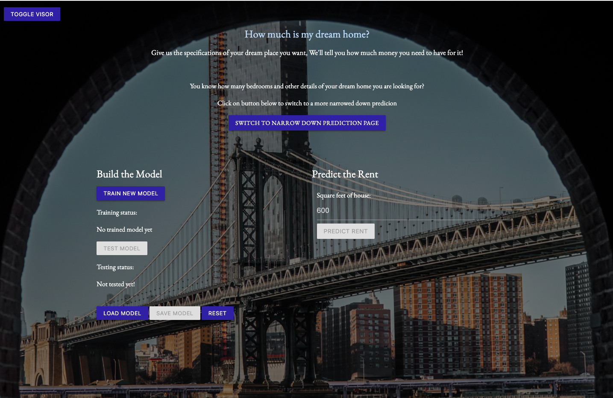
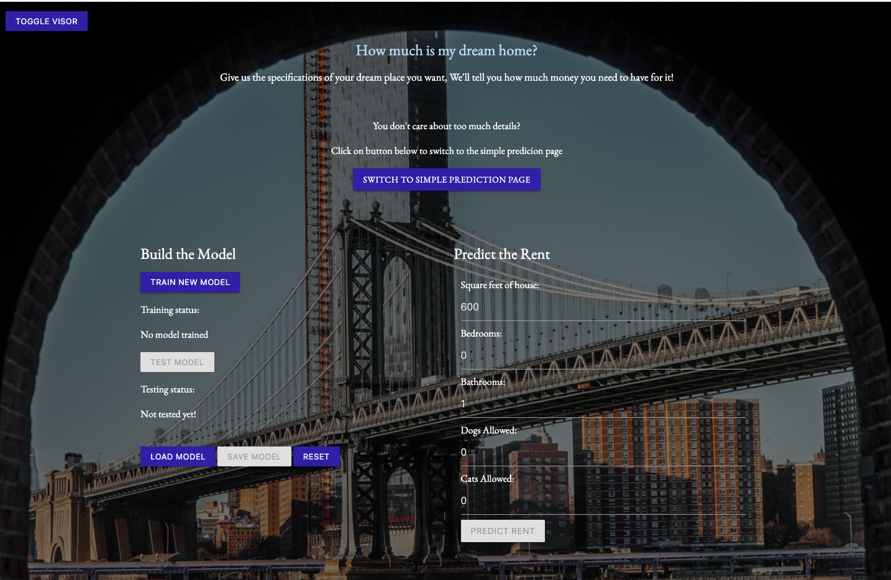
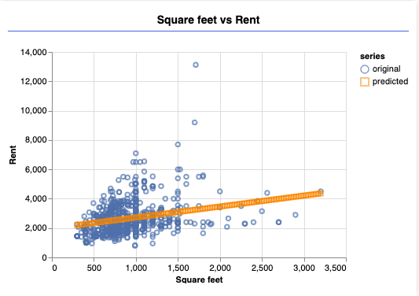
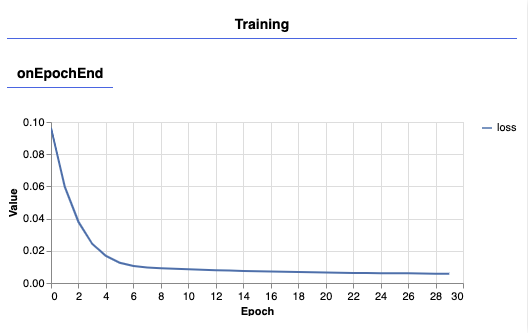
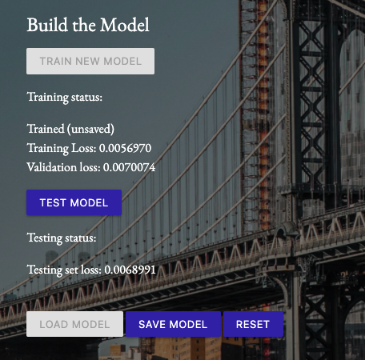
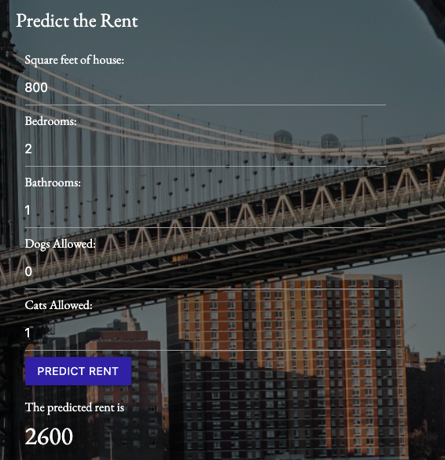

# How much is my dream house?
## Regression with Tensorflow.JS
----------
## Table of Contents 
1. [Overview](#overview)
2. [Technologies](#technologies)
3. [Local Installation](#installation)
4. [App Display](#display)

## Overview
Finding one’s next place to live in can involve many difficulties. However, understanding the right budget for one’s desired house is the first step in the process. This can involve a lot of guessing and searching on house listings to come up with a number for the rent one will need to afford to be able to move. In this project I have tried to aim to make this easier for people who want to find their next place in New York City, to be able to see a prediction of their desired place rent. I have provided a user interface for the user with a simplistic and intuitive user experience design to do so.  

My goal out of this project was to build a web application that utilizes Tensorflow in JavaScript to give the user the ability to train, test and predict the rent based on user’s criteria for their next NYC house. The user is also able to view visualization of the datapoints and prediction line of rents using Tensorflow JS library on the web environment.

To read more about how I implemented and how the application works, you may read 

## Technologies
 * JavaScript
 * TensorFlow.JS
 * HTML
 * CSS
    * Materialize

## Local Installation
### Step 1: Git Clone
Clone Burger-Sequelize to your local git repo like the following:
> git clone git@github.com:sajadgzd/predictMyHouseML.git

or

> git clone https://github.com/sajadgzd/predictMyHouseML.git

The project and its files should now be in your project folder.

### Step 2: Launch app 
Via terminal type in these bash command once you are in the root directory 

> http-server 

Go to your browser and type in the given URL. Now you should see the application open locally.

## App Display

### Page 1

### Page 2

### Prediction Line on Page 1

### Training Performance on page 2

### Sample run of page 2

### Sample result of page 2

